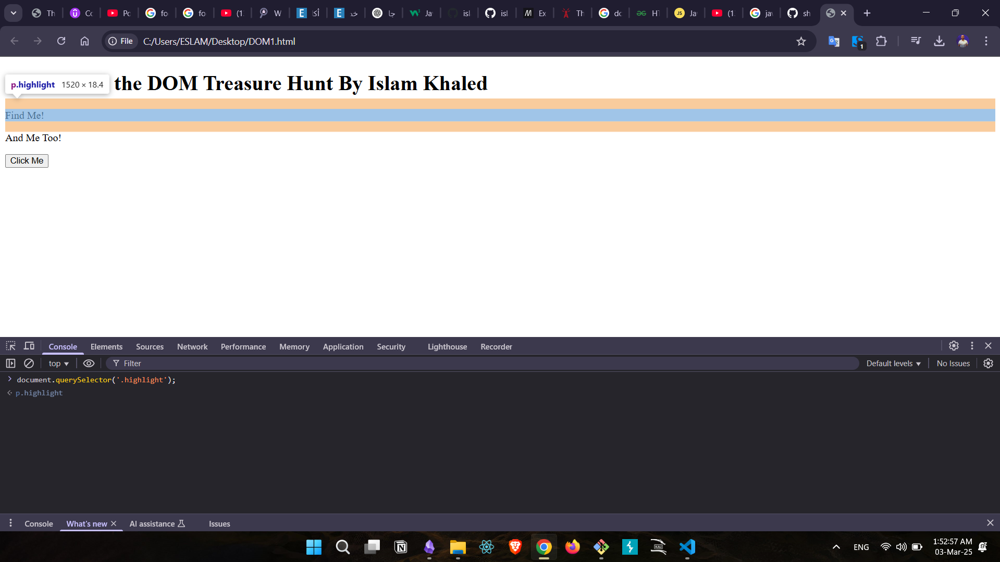
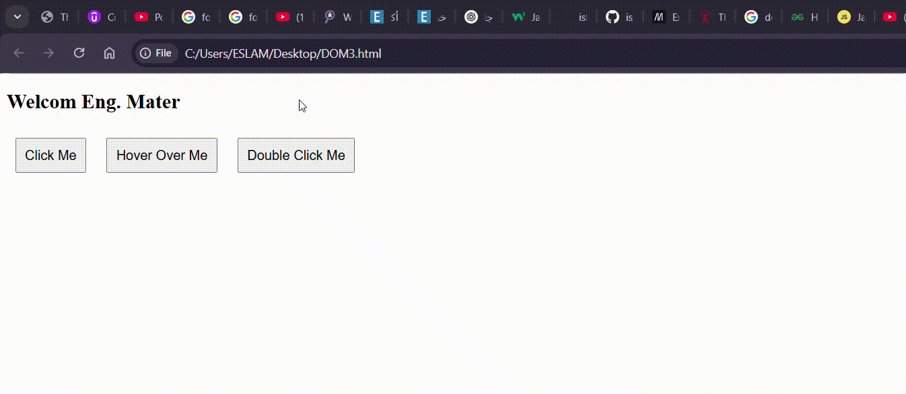

### **What is the DOM?**

The Document Object Model (DOM) is a programming interface for web documents. In simpler terms, it's like an organized map that represents the structure and content of a webpage. Think of it as a tree-like structure where each part of a webpage – like headings, paragraphs, images, buttons, and more – is a node. This tree of nodes is what allows JavaScript to access, modify, and manipulate the content of a webpage.

Let's take a look at this HTML code to better understand the DOM tree structure.
```
<!DOCTYPE html>
<html>
<head>
    <meta charset="UTF-8">
    <title>Exploring the DOM in JavaScript</title>
</head>
<body>
    <h1>Hello, World!</h1>
    <p>This is a simple HTML example.</p>
</body>
</html>
```

From a DOM perspective, each HTML element becomes a node in the DOM tree:

- `html` is the root node.
- `head` and `body` are child nodes of `html`.
- `meta` and `title` are child nodes of `head`.
- `h1` and `p` are child nodes of `body`.

Here's an alternative approach to visually represent this hierarchy of nodes.

[DOM Structure](images/DOM1.png)

### **Understanding** `window` and `document`

Before we dive into the practical examples, let's meet two important players: `window` and `document`.

- `window`: This is like the boss of the browser window. It represents the entire browser window and has control over things like opening new tabs, resizing the window, and more.
- `document`: This is like the page itself. It's an object that holds all the HTML elements on your page. When we say "DOM," we often mean the `document` object.

### **Finding Elements: Your Webpage's Treasure Hunt**

To truly grasp the magic of the DOM, let's start with a hands-on example. Imagine you have the following HTML structure:
```HTML
<!DOCTYPE html>
<html>
  <head>
    <title>Finding Elements Example</title>
  </head>
  <body>
    <h1>Welcome to the DOM Treasure Hunt</h1>
    <div id="container">
      <p class="highlight">Find Me!</p>
      <p>And Me Too!</p>
    </div>
    <button class="btn">Click Me</button>
  </body>
</html>
```

Now, let's dive into the various methods the DOM provides to help you find elements like a seasoned treasure hunter.


**1.** `getElementById()`**: The One with the ID**
Each element can have a unique ID. To locate an element by its ID, use the `getElementById()` method:

```js
document.getElementById('container');
```


**2.** `querySelector()`**: The Versatile Searcher**
For a broader search, the `querySelector()` method lets you use CSS selectors:

```js
document.querySelector('.highlight');
```



**3.** `querySelectorAll()`**: Gathering a Crowd**
Need to target multiple elements? The `querySelectorAll()` method is your friend:

```js
document.querySelectorAll('.btn');
```


**4.** `getElementsByClassName()`**: Grouping by Class**

When elements share a class, use `getElementsByClassName()`:

```js
document.getElementsByClassName('highlight');
```


---

### **Creating and Adding Elements to the DOM**

Creating and adding elements to the Document Object Model (DOM) is a fundamental aspect of web development that allows you to dynamically modify the content and structure of a web page. In this section, we will explore how to create new elements and insert them into the DOM using JavaScript.

**Creating Elements**

To create a new element in the DOM, you can use the `document.createElement()` method. This method takes the tag name of the element you want to create as an argument and returns a new element node. For example:

```js
const newDiv = document.createElement('div');
```

In this example, a new `<div>` element is created and stored in the `newDiv` variable.

**Modifying Element Properties**

You can modify various properties of the newly created element before adding it to the DOM. This includes setting attributes, adding classes, and applying styles.

```js
newDiv.className = 'box';
newDiv.id = 'myBox';
newDiv.setAttribute('title', 'A Box Element');
newDiv.style.backgroundColor = 'blue';
newDiv.textContent = 'This is a blue box.';
```

**Appending Elements**

Once you've created and configured the new element, you can append it to an existing element in the DOM using methods like `appendChild()` or `insertBefore()`.

```js
const parentElement = document.getElementById('container');
parentElement.appendChild(newDiv);
```

In this example, the `newDiv` element is appended as a child of the element with the ID `container`.

**Example: Creating a Dynamic List**

Let's create a simple example where we generate an unordered list (UL) and populate it with list items (LI) based on an array of data.

```HTML
<!DOCTYPE html>
<html>
<head>
    <title>Dynamic List Example</title>
</head>
<body>
    <ul id="myList"></ul>
    <script>
        const data = ['Apple', 'Banana', 'Cherry', 'Date'];

        const myList = document.getElementById('myList');

        data.forEach(item => {
            const listItem = document.createElement('li');
            listItem.textContent = item;
            myList.appendChild(listItem);
        });
    </script>
</body>
</html>
```


##  How Finding HTML Objects

| Property                 | Description                                                      |
| ------------------------ | ---------------------------------------------------------------- |
| document.baseURI         | Returns the absolute base URI of the document                    |
| document.body            | Returns the `<body>` element                                     |
| document.cookie          | Returns the document's cookie                                    |
| document.doctype         | Returns the document's doctype                                   |
| document.documentElement | Returns the `<html>` element                                     |
| document.documentMode    | Returns the mode used by the browser                             |
| document.documentURI     | Returns the URI of the document                                  |
| document.domain          | Deprecated. Do not use it.                                       |
| document.domConfig       | Deprecated. Do not use it.                                       |
| document.embeds          | Returns all `<embed>` elements                                   |
| document.forms           | Returns all `<form>` elements                                    |
| document.head            | Returns the `<head>` element                                     |
| document.images          | Returns all  elements                                       |
| document.implementation  | Returns the DOM implementation                                   |
| document.inputEncoding   | Returns the document's encoding (character set)                  |
| document.lastModified    | Returns the date and time the document was updated               |
| document.links           | Returns all <area> and `<a>` elements that have a href attribute |
| document.readyState      | Returns the (loading) status of the document                     |
| document.referrer        | Returns the URI of the referrer (the linking document)           |
| document.scripts         | Returns all `<script>` elements                                  |

---

### DOM Events & Event Listeners?

- **DOM Events** are actions that happen in the browser, such as:  
     Clicking a button (`click`)  
     Hovering over an element (`mouseover`)  
     Typing in an input field (`keydown`, `keyup`)  
     Submitting a form (`submit`)

#### Event Listeners**

- An **Event Listener** is a way to make your webpage **respond** to events.
- We use `addEventListener()` to attach an event to an element.

##### Example:
```html
<!DOCTYPE html>
<html lang="en">
<head>
    <meta charset="UTF-8">
    <meta name="viewport" content="width=device-width, initial-scale=1.0">
    <title>Event Listener Example</title>
    <style>
        button {
            margin: 10px;
            padding: 10px;
            font-size: 16px;
            cursor: pointer;
        }
    </style>
</head>
<body>
    <h2> Welcom Eng. Mater </h2>

    <button id="btn1">Click Me</button>
    <button id="btn2">Hover Over Me</button>
    <button id="btn3">Double Click Me</button>

    <script>
        // Get the buttons
        const btn1 = document.getElementById('btn1');
        const btn2 = document.getElementById('btn2');
        const btn3 = document.getElementById('btn3');

        // Event Listener for Click
        btn1.addEventListener('click', function() {
            alert('IslamKh clicked this button!');
        });

        // Event Listener for Hover (mouseover)
        btn2.addEventListener('mouseover', function() {
            alert('Welcome Eng. Matar!');
        });
        
        // Event Listener for Double Click
        btn3.addEventListener('dblclick', function() {
            alert('IslamKh double-clicked this button!');
        });
    </script>
</body>
</html>
```




#### **Explanation of the Code**

1. **We selected the buttons using `document.getElementById()`**

```js
const btn1 = document.getElementById('btn1'); const btn2 = document.getElementById('btn2'); const btn3 = document.getElementById('btn3');`
```

2. **We added an event listener for each button:**
- **Button 1 (`click` event)**
```js
btn1.addEventListener('click', function() {
    alert('Islam clicked this button!');
});

```
When clicked the button, an **alert message** appears

- Button 2 (`mouseover` event)

```js
btn2.addEventListener('mouseover', function() {
    alert('Welcom Eng. Mater!');
});

```
When  hover over the button, an **alert message** appears.

- **Button 3 (`dblclick` event)**
```js
btn3.addEventListener('dblclick', function() {
    alert('Islam double-clicked this button!');
});

```
When **double-clicks** the button, an **alert message** appears.

---

### **This is a List of JavaScript Event Handlers"**

- **Page Events** such as: `onload`, `onunload`, `onbeforeunload`, `onpageshow`, `onpagehide`.
- **User Interaction Events** such as: `onclick`, `ondblclick`, `onmousedown`, `onmouseup`, `onmousemove`.
- **Input & Form Events** such as: `onchange`, `oninput`, `onfocus`, `onblur`, `onsubmit`, `onreset`.
- **Media Events** such as: `onplay`, `onpause`, `onended`, `onvolumechange`.
- **Animation & Transition Events** such as: `onanimationstart`, `onanimationend`, `ontransitionend`.
- **Drag & Drop Events** such as: `ondrag`, `ondragover`, `ondrop`.
- **Mouse Events** such as: `onmouseover`, `onmouseout`, `onmouseenter`, `onmouseleave`.
- **Keyboard Events** such as: `onkeydown`, `onkeyup`, `onkeypress`.
- **Scroll Events** such as: `onscroll`, `onscrollend`.
- **Pointer Events** such as: `onpointerdown`, `onpointermove`, `onpointerup`.
- **Touch Events** such as: `ontouchstart`, `ontouchmove`, `ontouchend`.
